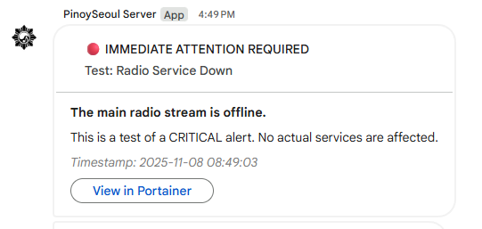
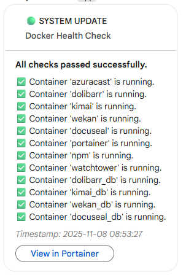
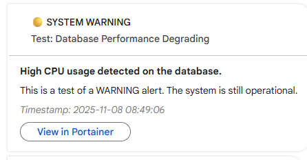
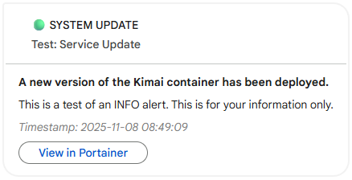
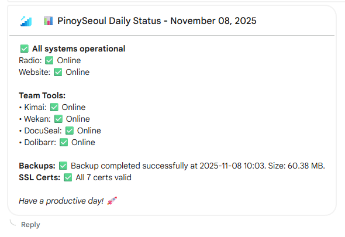

# PinoySeoul Infrastructure Monitor

> **Your 24/7 automated watchdog for PinoySeoul Media's self-hosted infrastructure.**

<!-- Badges -->
<p align="center">
  
  
  
  
  
</p>

This project, developed by Nash Ang for PinoySeoul Media Enterprise, is a robust, self-hosted monitoring and alerting service. It proactively keeps an eye on critical services like Docker containers, SSL certificates, and daily backups, instantly notifying your team via Google Chat when issues arise. Designed for reliability and ease of use, it ensures your digital infrastructure runs smoothly, empowering cultural exchange through 24/7 streaming, creator partnerships, and AI-powered content.


</br>
*Caption: An example of a critical alert sent to Google Chat, showing immediate notification of a service outage.*

## Quick Links
- [Project Overview](#1-project-overview)
- [Features & Capabilities](#2-features--capabilities)
- [Tech Stack](#3-tech-stack)
- [Prerequisites](#4-prerequisites)
- [Installation](#5-installation)
- [Configuration Guide](#6-configuration-guide)
- [Usage](#7-usage)
- [Setting up Automation (Cron)](#8-setting-up-automation-cron)
- [Alert Showcase](#9-alert-showcase)
- [Troubleshooting](#10-troubleshooting)
- [Project Structure](#11-project-structure)
- [Contributing](#12-contributing)
- [License](#13-license)
- [Author & Acknowledgments](#14-author--acknowledgments)

---

## 1. Project Overview

The PinoySeoul Monitoring Service is a lightweight, standalone Python application that runs on your server to proactively monitor the health of all your critical services. It is designed to run quietly in the background, perform regular checks, and instantly notify your team via Google Chat the moment an issue is detected.

This project solves the problem of "silent failures." Instead of manually checking if your websites are online or if your backups completed, this service automates the process. It acts as a 24/7 watchdog, giving you peace of mind and allowing your team to react to problems immediately, not hours or days later.

### Key Features
- ✅ **Automated Health Checks:** Runs checks for Docker, SSL, and backups on a configurable schedule.
- 🚀 **Proactive Alerting:** Sends instant, user-friendly alerts to Google Chat when an issue is detected.
- 📊 **Daily Summaries:** Delivers a daily "all-clear" report so you know everything is running smoothly.
- ⚙️ **Highly Configurable:** Easily manage all settings from a single, central `config.yml` file.
- 🔧 **Beginner-Friendly:** Designed with clear, simple code and extensive documentation.

---

## 2. Features & Capabilities

### Docker Container Monitoring
The service connects to your local Docker daemon to ensure all your application containers are running. It can detect stopped, exited, or unstable (restarting) containers and immediately alert you, using friendly names (e.g., "Dolibarr CRM" instead of "dolibarr_container_1").

### SSL Certificate Checking
It automatically checks the SSL certificates for all your public-facing domains. You'll receive a `WARNING` alert when a certificate is due for renewal (less than 30 days) and a `CRITICAL` alert if it's about to expire (less than 7 days), preventing security warnings and loss of visitor trust.

### Backup Verification
Instead of just hoping your backups worked, this monitor parses your `rclone` log files to verify that the backup process completed successfully, had no errors, and produced a file of a reasonable size. This provides true confirmation that your data is safe.

### AzuraCast Daily Listener Report
Connects to your AzuraCast radio station's API to fetch and report the total number of unique listeners for the day, sending a motivational summary to your team each evening.

### User-Friendly Google Chat Alerts
Alerts are designed to be understood by everyone, not just technical users. They clearly state the problem, the business impact, and who is handling it, turning cryptic errors into actionable information.

### Daily Summary Reports
Every morning, the service sends a single, clean summary report to Google Chat, confirming the status of all monitored systems. This "all-clear" signal is a great way to start the day with confidence.

---

## 3. Tech Stack
- **Core Language:** Python 3.8+
- **Container Engine:** Docker & Docker SDK for Python
- **Alerting Platform:** Google Chat Webhooks
- **Main Libraries:**
  - `PyYAML` - For parsing the `config.yml` file.
  - `python-dotenv` - For loading secrets from the `.env` file.
  - `requests` - For sending alerts to the webhook URL.

---

## 4. Prerequisites

Before you begin, ensure you have the following:

- [ ] **Server Access:** SSH access to the Ubuntu server where your Docker containers are running.
- [ ] **Python:** Python 3.8 or higher installed (`python3 --version`).
- [ ] **Docker:** Docker is installed and running (`docker --version`).
- [ ] **Google Chat Space:** A Google Chat room (Space) where you have permission to add a webhook for alerts.

---

## 5. Installation

Installation is automated with a guided setup script.

### Step 1: Clone the Repository
First, get the project code onto your server.
```bash
git clone <your-repository-url> pinoyseoul-monitor
cd pinoyseoul-monitor
```

### Step 2: Run the Setup Script
The `setup.sh` script will prepare everything for you.

```bash
bash scripts/setup.sh
```
This script will:
1. Check for Python.
2. Create a local Python virtual environment (`.venv/`).
3. Install all required packages from `requirements.txt`.
4. Create your `config.yml` and `.env` files from the examples.
5. Prompt you to edit your configuration.

### Step 3: Configure Your Settings
The setup script will pause and ask you to edit two files:
- **`.env`**: Open this file and paste your Google Chat webhook URL.
- **`config.yml`**: Open this file and review the settings to ensure they match your setup.

### Step 4: Test the Webhook
After you save your configuration, press Enter in the terminal. The setup script will automatically run `python main.py --test` to send a test message to your webhook.

---

## 6. Configuration Guide

All settings are managed in `config.yml`.

### Getting a Google Chat Webhook
1. In your Google Chat room, click the room name at the top.
2. Select **Apps & Integrations**.
3. Click **Manage webhooks**.
4. Give your webhook a name (e.g., "Server Alerts") and an optional avatar.
5. Click **Save** and copy the full webhook URL provided.

### Editing `config.yml`
This file is organized into sections:
- **`docker`**: Enable/disable the Docker check and map your technical container names to friendly names.
- **`ssl`**: Enable/disable the SSL check and list all the domains you want to monitor.
- **`backup`**: Enable/disable the backup check and provide the correct `log_path`, `min_size_mb` (e.g., `50`), and `max_age_hours`.
- **`portainer`**: Set the URL for the "View in Portainer" button in alerts.
- **`logging`**: Configure the application's own logging behavior.

---

## 7. Usage

All commands should be run from the project's root directory with the virtual environment activated (`source .venv/bin/activate`).

### Running Manual Checks
You can trigger any check manually. This is great for testing or getting an instant status update.

Below is an example of the terminal output when running a manual check.

</br>
*Caption: Running a manual check provides immediate feedback on the console.*

```bash
# Check the status of all Docker containers
python main.py --check docker

# Check the status of all SSL certificates
python main.py --check ssl

# Check the status of the last backup
python main.py --check backup

# Run all checks at once
python main.py --check all
```

### Sending a Daily Summary
To manually trigger the daily summary report:
```bash
python main.py --summary
```

### Sending the Listener Report
To manually trigger the AzuraCast daily listener report:
```bash
python main.py --listener-summary
```

### Testing the Webhook
This command sends a simple test message to your configured webhook.
```bash
python main.py --test
```

### Reading Logs
The application's own logs are stored in the directory specified in `config.yml` (default: `./logs/monitor.log`). You can view them with:
```bash
tail -f logs/monitor.log
```

---

## 8. Setting up Automation (Cron)

To make the monitor truly automated, schedule the scripts to run using `cron`.

1. Open your user's crontab file for editing:
   ```bash
   crontab -e
   ```
2. Add lines for each check you want to automate.

### Example Crontab Entries
```cron
# PinoySeoul Monitor Schedule
# -----------------------------------------------------------------------------
# Check Docker container health every 5 minutes.
*/5 * * * * /bin/bash /home/pinoyseoul/pinoyseoul-monitor/scripts/run_checks.sh docker >> /home/pinoyseoul/pinoyseoul-monitor/logs/cron.log 2>&1

# Check SSL certificates once a day at 8:00 AM.
0 8 * * * /bin/bash /home/pinoyseoul/pinoyseoul-monitor/scripts/run_checks.sh ssl >> /home/pinoyseoul/pinoyseoul-monitor/logs/cron.log 2>&1

# Check backup status once a day at 8:05 AM (after the backup has run).
5 8 * * * /bin/bash /home/pinoyseoul/pinoyseoul-monitor/scripts/run_checks.sh backup >> /home/pinoyseoul/pinoyseoul-monitor/logs/cron.log 2>&1

# Send the daily listener summary report every day at 8:00 PM (20:00).
0 20 * * * /bin/bash /home/pinoyseoul/pinoyseoul-monitor/scripts/run_checks.sh listener_summary >> /home/pinoyseoul/pinoyseoul-monitor/logs/cron.log 2>&1

# Send the daily summary report every day at 9:00 AM.
0 9 * * * /home/pinoyseoul/pinoyseoul-monitor/.venv/bin/python /home/pinoyseoul/pinoyseoul-monitor/main.py --summary >> /home/pinoyseoul/pinoyseoul-monitor/logs/cron.log 2>&1
```

---

## 9. Alert Showcase

Below are examples of what the alerts look like in Google Chat.

### Critical Alert

</br>
*Caption: A CRITICAL alert is sent in red for immediate attention when a service is down.*

### Warning Alert

</br>
*Caption: A WARNING alert is sent in yellow for issues that need attention but are not critical.*

### Info Alert

</br>
*Caption: An INFO alert is sent in green for successful, non-critical events.*

### Daily Summary

</br>
*Caption: The daily summary provides a clean, "all-clear" status report.*

---

## 10. Troubleshooting

- **Issue:** Alerts are not appearing in Google Chat.
  - **Solution:** Run `python main.py --test`. If it fails, your `GOOGLE_CHAT_WEBHOOK_URL` in the `.env` file is likely incorrect.

- **Issue:** `docker` command fails with "permission denied".
  - **Solution:** The user running the script is not in the `docker` group. Run `sudo usermod -aG docker $USER`, then **log out and log back in**.

- **Issue:** SSL checks are failing for a valid site.
  - **Solution:** Your server may be having DNS resolution issues or is being blocked by a firewall from reaching the domain. Try to `curl https://thedomain.com` from the server to see the error.

- **Where to find logs?**
  - **This application's logs:** Check the `log_dir` specified in `config.yml` (default is `./logs/monitor.log`).
  - **Cron job logs:** Check the file you are redirecting output to in your `crontab` entry (e.g., `./logs/cron.log`).

---

## 11. Project Structure
```
pinoyseoul-monitor/
├── config.yml           # Your active configuration file.
├── main.py              # The main entry point for the application.
├── README.md            # This file.
├── monitors/            # Contains all the individual checking logic.
├── utils/               # Contains helper modules (alerts, logging).
└── scripts/             # Contains shell scripts for setup and automation.
```

---

## 12. Contributing

If you find a bug or have an idea for a new feature, please open an issue on the project's GitHub page.

---

## 13. License

This project is licensed under the **MIT License**.

---

## 14. Author & Acknowledgments

- **Author:** Nash Ang
- **Portfolio:** https://subtleazn.github.io
- **Acknowledgments:** This project was built to support the [PinoySeoul Media Enterprise](https://pinoyseoul.com).
