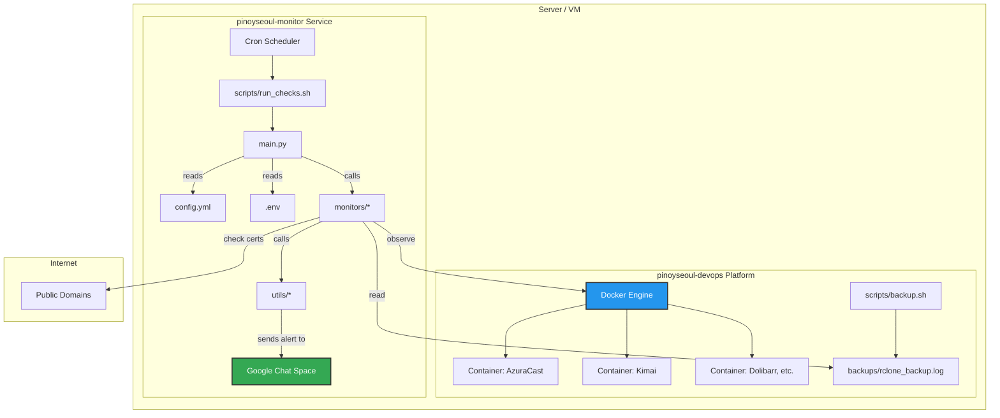

# PinoySeoul Monitor: Technical Architecture

This document provides a technical overview of the PinoySeoul Monitoring Service, intended for developers, system administrators, and portfolio reviewers.

---

## 1. System Architecture Diagram

The monitoring service runs as a standalone application on the same server as the `pinoyseoul-devops` platform. It operates independently but is configured to observe the services managed by the main platform.



---

## 2. Component Interaction

The project is divided into four main logical components:

- **`main.py` (The Orchestrator):** This is the brain of the application. It uses `argparse` to understand command-line instructions (`--check`, `--summary`). Its primary job is to load the central `config.yml`, set up the logger, and then call the appropriate monitor module based on the user's command.

- **`monitors/` (The Specialists):** This directory contains the individual modules that perform the actual work. Each module is a specialist for a single type of check. They are designed to be self-contained: they know how to perform their check, evaluate the result, and send an alert if necessary. They return a structured dictionary summarizing their findings for use in daily summaries.
  - `docker_health.py`: Connects to the Docker socket.
  - `ssl_check.py`: Makes outbound connections to public domains.
  - `backup_check.py`: Parses the local `rclone` log file.
  - `azuracast_check.py`: Connects to the AzuraCast API to get listener data.

- **`utils/` (The Helpers):** This directory contains common utilities used by other parts of the application.
  - `logger.py`: Sets up application-wide logging to both the console and a rotating file.
  - `google_chat.py`: The dedicated "messenger." Its only job is to accept data, format it into a beautiful Google Chat Card v2 payload, and send it to the webhook URL.

- **`scripts/` (The Entrypoints):** These shell scripts provide a reliable way to interact with the application from the command line or an automated scheduler like `cron`.
  - `setup.sh`: Prepares the server by creating the Python environment and installing dependencies.
  - `run_checks.sh`: A simple wrapper that ensures the Python virtual environment is activated before running `main.py`. This prevents common `cron` job errors related to environment paths.

---

## 3. Data Flow Diagrams

### Data Flow for a Manual Check (`--check docker`)

This diagram shows the sequence of events when a user or cron job triggers a single check.

```
[User/Cron]
     |
     v
[scripts/run_checks.sh docker] -- Activates .venv
     |
     v
[main.py --check docker]
     | 1. Loads config.yml & .env
     | 2. Sets up logging
     | 3. Calls check_docker_health()
     v
[monitors/docker_health.py]
     | 1. Connects to Docker socket
     | 2. Loops through containers
     | 3. Finds a 'stopped' container
     v
[utils/google_chat.py]
     | 1. Called by docker_health.py via send_alert()
     | 2. Formats a CRITICAL alert card
     | 3. Sends POST request to webhook URL
     v
[Google Chat API]
     |
     v
[Team's Chat Room] -- Displays alert
```

### Data Flow for a Daily Summary (`--summary`)

This diagram shows how the daily summary is compiled.

```
[Cron]
     |
     v
[main.py --summary]
     | 1. Loads config
     | 2. Calls check_docker_health()
     | 3. Calls check_ssl_certs()
     | 4. Calls check_backup_health()
     v
[main.py] -- Collects 3 result dictionaries
     | 1. Formats the data into a summary message
     | 2. Calls send_daily_summary()
     v
[utils/google_chat.py]
     | 1. Formats the Daily Summary card
     | 2. Sends POST request to webhook URL
     v
[Google Chat API]
     |
     v
[Team's Chat Room] -- Displays summary
```

---

## 4. Alert Decision Tree (Example: SSL Check)

This tree illustrates the logic within a single monitor module.

```
check_ssl_certs(domain):
  |
  +-- Can connect to domain on port 443?
       |
       +-- NO: --> [Return 'error' status]
       |         `-> [Send WARNING Alert: "Cannot Check SSL"]
       |
       +-- YES: -> Get certificate from server
            |
            +-- Is certificate valid (hostname match, trusted chain)?
                 |
                 +-- NO: --> [Return 'critical' status]
                 |         `-> [Send CRITICAL Alert: "Invalid SSL Certificate"]
                 |
                 +-- YES: -> Calculate days until expiry
                      |
                      +-- days_left < 0?
                      |    `-> [Return 'critical' status]
                      |        `-> [Send CRITICAL Alert: "Certificate EXPIRED"]
                      |
                      +-- days_left < 7?
                      |    `-> [Return 'critical'status]
                      |        `-> [Send CRITICAL Alert: "Expiring Soon"]
                      |
                      +-- days_left < 30?
                      |    `-> [Return 'warning' status]
                      |        `-> [Send WARNING Alert: "Renewal Due"]
                      |
                      +-- ELSE (>= 30 days):
                           `-> [Return 'valid' status]
                               `-> [No Alert Sent]
```
